## Введение

Программа, управляющая рендерингом векторной графики – своего рода графический движок, в основе которого лежит QOpenGL (OpenGL Qt). Была написана с цлеью изучения библиотеки OpenGL и фреймворка Qt. 
Библиотека позволит пользователю создавать полноценные 3D игры, не углубляясь в изучение трёхмерной графики: построение перспективы, наложение текстур и в принципе весь процесс отрисовки она берёт на себя.
Экземпляры классов, экспортируемых из dll, рекомендуется разместить на специальной форме, встроенной в Qt, для получения возможности оформить приложение желаемыми виджетами: кнопки, выпадающие окна и прочее.

В качестве примера эксплуатации графического движка продемонстрировано приложение, использующее API, которое, в свою очередь, взаимодействует с классами реализованной библиотеки. Для передачи информации между приложениями используется фабрика объектов.

В большинстве случаев разработчики используют управляющие конструкции switch или if, чтобы определить экземпляр какого класса им необходимо создать. И чем больше возможных вариантов появляется, тем активнее разрастается эта конструкция, впоследствии превращающаяся в уродливого монстра. Фабрика объектов может создавать объекты определенного типа, использующие единый интерфейс.
Фабрика объектов должна предоставить не только возможность создания объектов. Мы всегда точно сможем узнать, зарегистрирован ли у неё определённый класс, количество таковых. Помимо этого фабрика, конечно же, предоставляет удобные методы добавления и удаления классов в фабрику. С помощью фабрики можно ограничивать набор возможных классов, которая она будет создавать, используя некую конфигурацию.

----------------------------------------------------------------

### GraphicsPipeline – главная фабрика, интерфейс, реализациями которого являются SkyBoxFactory, SceneObjectFactory, ViewCameraFactory.
* pullout() – метод, возвращающий объект соответствующего типа (skybox, object3D, camera).

### WorldEngineObject - интерфейс, который обязаны реализовать все классы, претендующие на отрисовку на сцене.

* rotate – поворот вокруг оси.
* translate – растяжение в пространстве по заданным координатам.
* scale – масштабирование.
* setGlobalTransform – установить локальную систему координат в пределах глобальной.
* draw – отрисовка функциями OpenGL.

### object3D – класс трехмерного объекта:

* init – создание по умолчанию (куб).
* loadObjectFromFile – на вход подаётся путь к файлу 3D модели.
* calculateTBN – рассчитать матрицу TBN, необходимую для отрисовки шейдеров.

### skybox – окружение всех объектов, класс, описывающий локацию:
* в полях содержит object3D, созданный по умолчанию.

### camera – класс, описывающий камеру от первого лица:
* rotateX, rotateY – поворот относительно оси Х и Y соответственно.
* getViewMatrix – посмотреть текущее состояние видовой матрицы камеры.

### GraphicsBuilder – интерфейс, который необходимо реализовать классам, созданным для конструирования 3D объектов. За основу проектирования взят паттерн Fluent Builder.

* buildMaterial – метод, собирающий шейдеры по входным данным (путь к файлу). Возвращает GraphicsBuilder. 
* buildFromBuffer – получить объект из списка вершин.
* buildFromFile – получить объект из файла 3D модели.

### Object3DBuilder – класс, реализующий интерфейс GraphicsBuilder относительно object3D.

----------------------------------------------------------------

## Демонстрация

По редактируемой сцене можно свободно перемещаться с помощью клавиш:
* A – влево;
* W – вперёд;
* S – назад;
* D – вправо; 
* Q – вниз;
* E – вверх.
* Осматриваться можно, зажимая левую кнопку мыши и перемещая курсор одновременно.
* Реализована и возможность отдаления/приближения в формате взаимодействия с колёсиком мыши
* R – камера вернётся в исходную позицию (все параметры будут сброшены).
При запуске на сцену загружается группа объектов, с которыми можно полноценно оперировать, однако их изначальное предназначение – демонстрация функционала взаимодействия с объектами

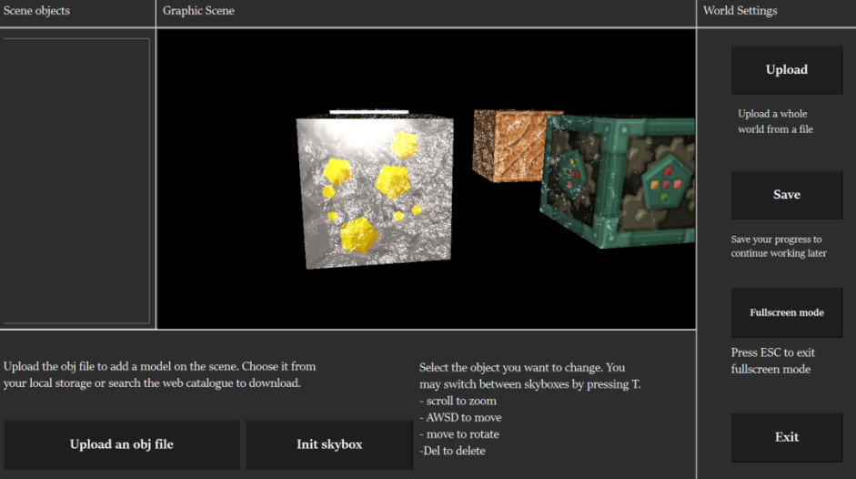

Объекты можно выделять, чтобы применять изменения над целой группой сразу. При желании объект можно удалить из группы повторным нажатием мышью на него

Пользователь может изменять объекты следующими способами:
* перемещение осуществляется аналогично перемещению камеры;
* поворот в трёх осях осуществляется перемещением курсора и зажатой левой кнопкой мыши одновременно;
* масштабирование колёсиком мыши;
* удаление по нажатию на клавишу DEL

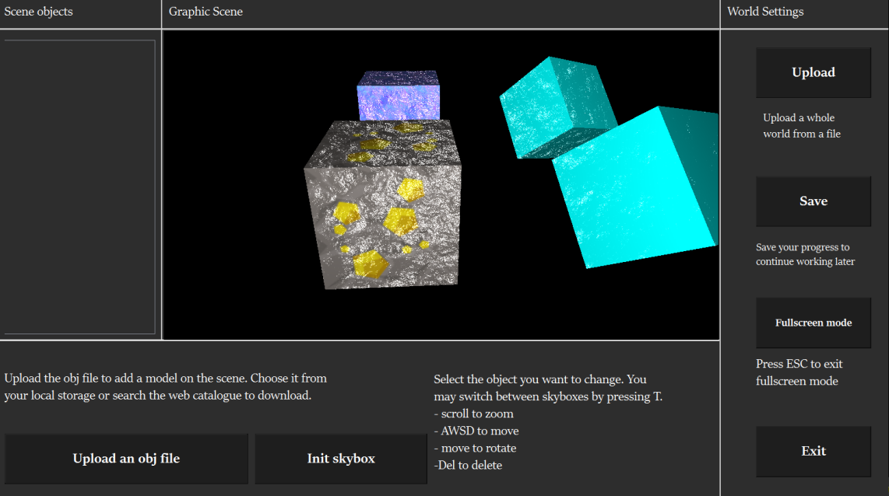

## Взаимодействие с графическими виджетами приложения

Помимо обработки нажатий на клавиатуру и отслеживания перемещения курсора мыши, программа предоставляет возможность взаимодействия при помощи кнопок. 

### Init skybox 
Создание новой локации. Программа предлагает сначала скачать текстуру из удалённого хранилища. 

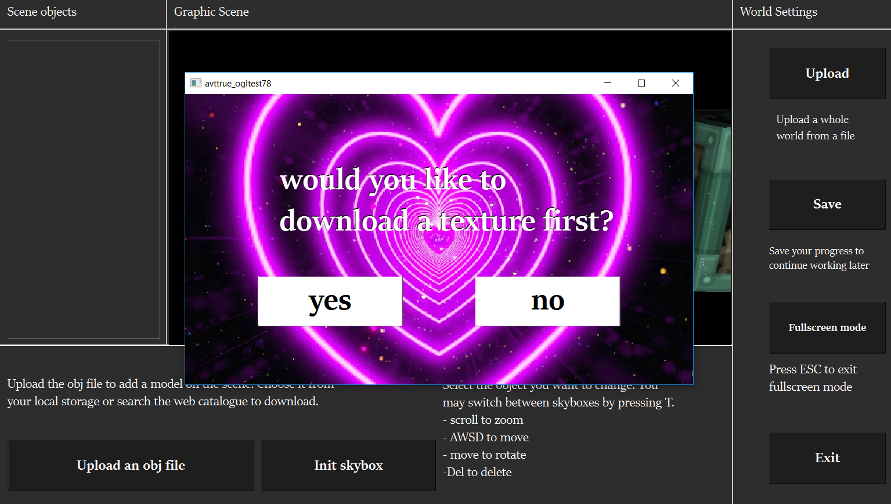

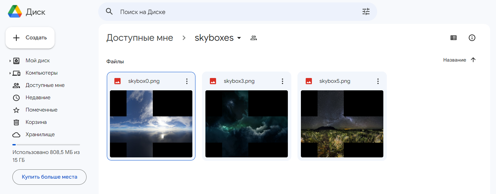

Если это необязательно, можно сразу загрузить изображение из дискового пространства.

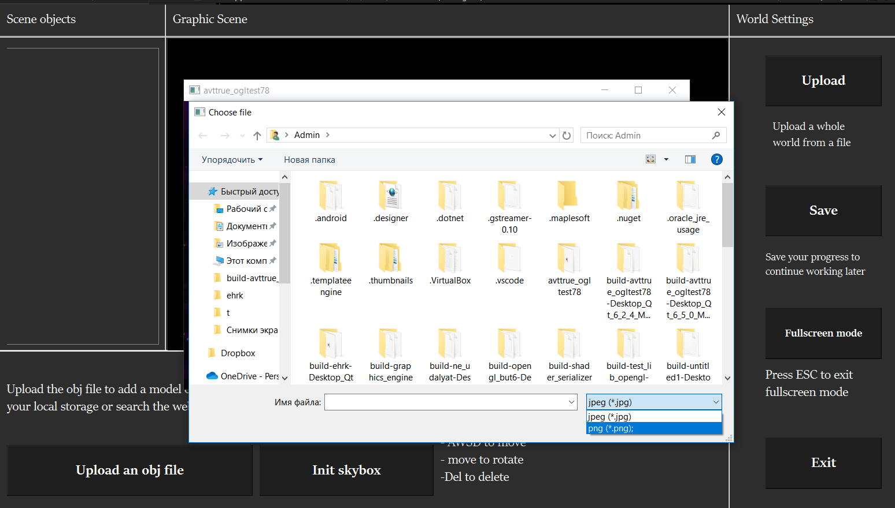

При добавлении новой локации она появляется в боковом списке.

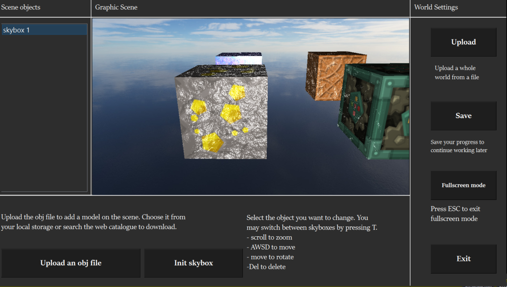

Переключаться между локациями можно, выбирая элементы данного списка или нажимая клавишу «T». В данном случае локации будут сменять друг друга по кругу (т.е. из последней осуществится перемещение в первую).

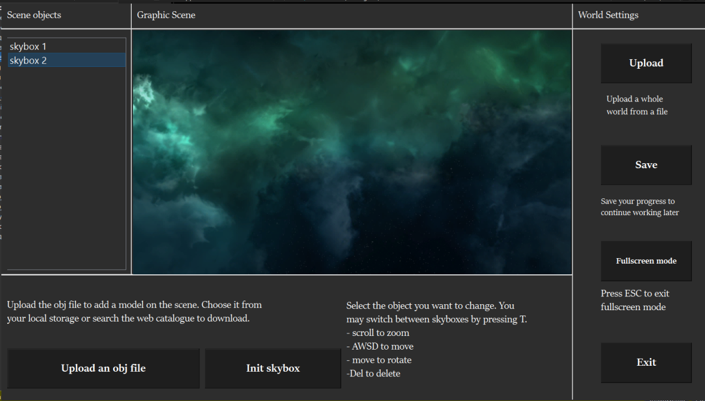

### Upload an obj file

Добавление трёхмерного объекта на сцену. Программа работает с файлами формата obj.

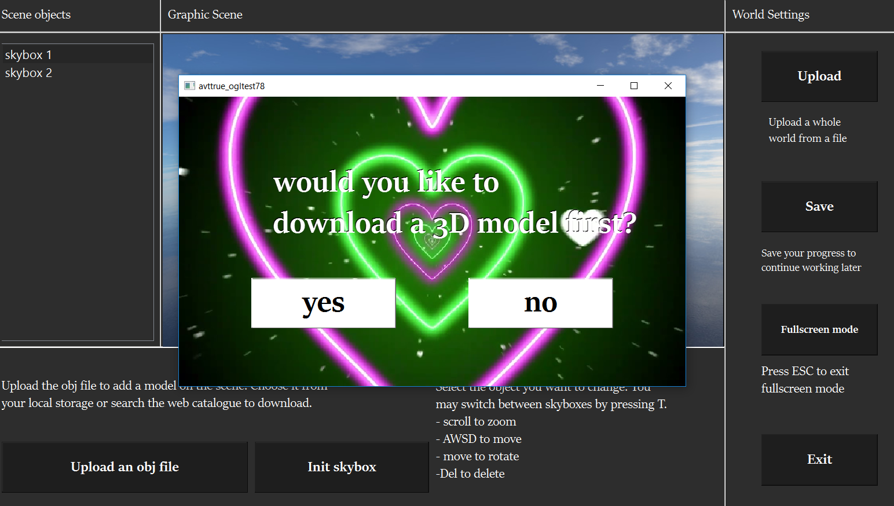

Приложение предлагает сначала скачать модель из удалённого хранилища. 

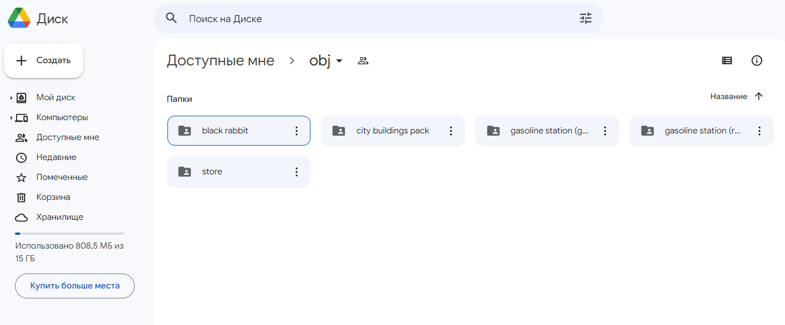

Если это необязательно, можно сразу загрузить файл из локального. Объект добавится на текущую локацию.

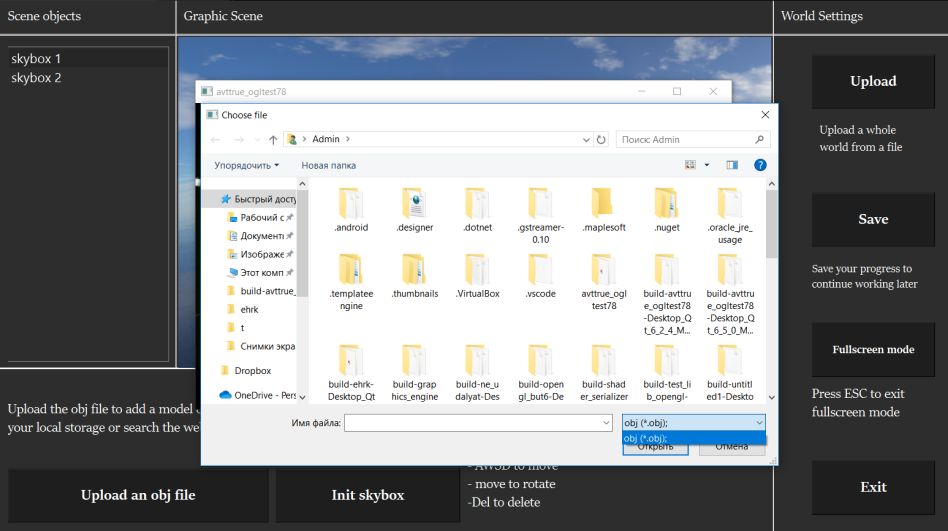
 
Загруженная модель появляется на текущей локации.

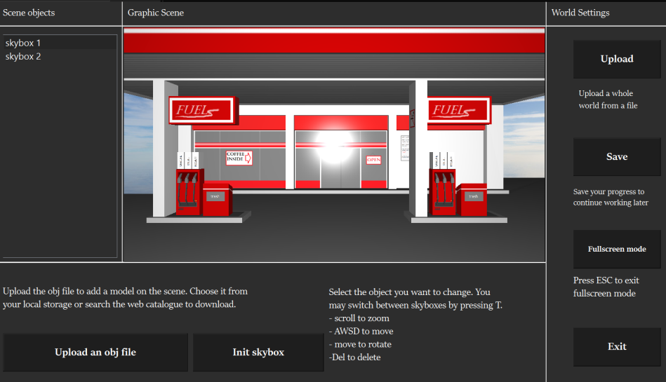

### Upload

Возможность загрузить сохранённый прогресс из файла .json, чтобы продолжить работать с ранее созданной сценой.

Программа предложит скачать сохранённый мир с удалённого сервера или сразу загрузить его из локального хранилища (т.е. дискового пространства). 

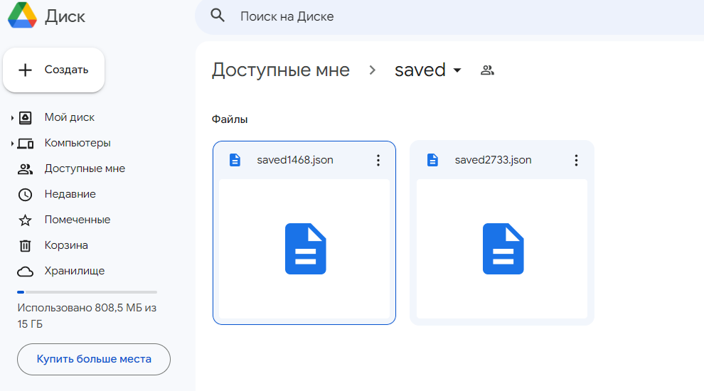

Загруженный мир:

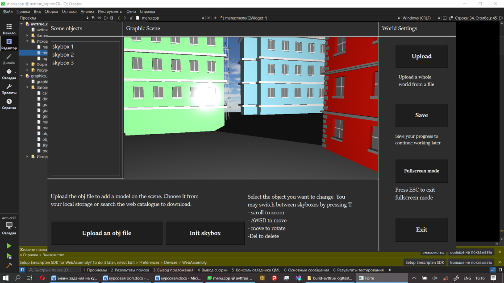

### Save

Сохранить текущий прогресс в файл формата json. Записывается состояние объектов сцены, созданные локации. При дальнейшей загрузке все файлы obj должны находиться в папках, из которых они были загружены первоначально. Для названия сохраняемого файла программа генерирует случайно число и дописывает его к слову «saved». Сохранённые файлы могут выглядеть так:

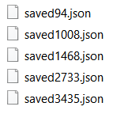

### Fullscreen

Развернуть сцену на весь экран. Возможности редактирования (выбор объектов по клику мыши для изменения), переключение между локациями (клавиша «T») сохраняются. По сцене можно свободно перемещаться с помощью описанной ранее механики. Для выхода из режима Fullscreen необходимо нажать клавишу «ESC». 

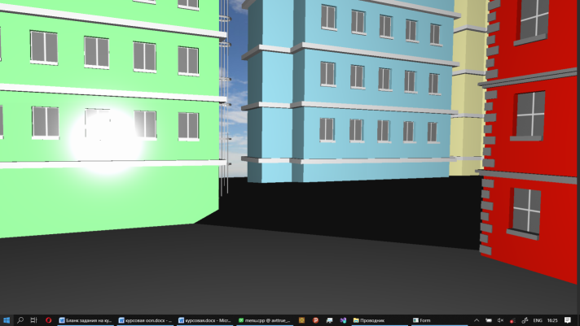
 
### Exit

Перед выходом программа предлагает записать текущий прогресс или завершить редактирование без сохранения.

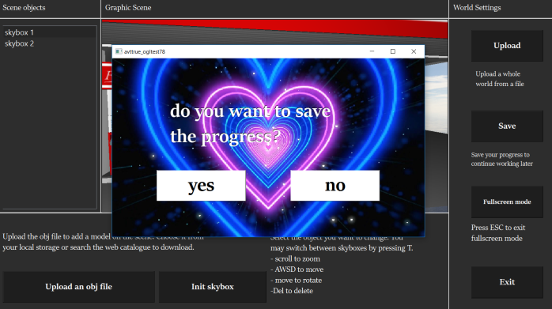 
 

Рисунок 4.23 – Отклик программы на нажатие кнопки «Exit»
